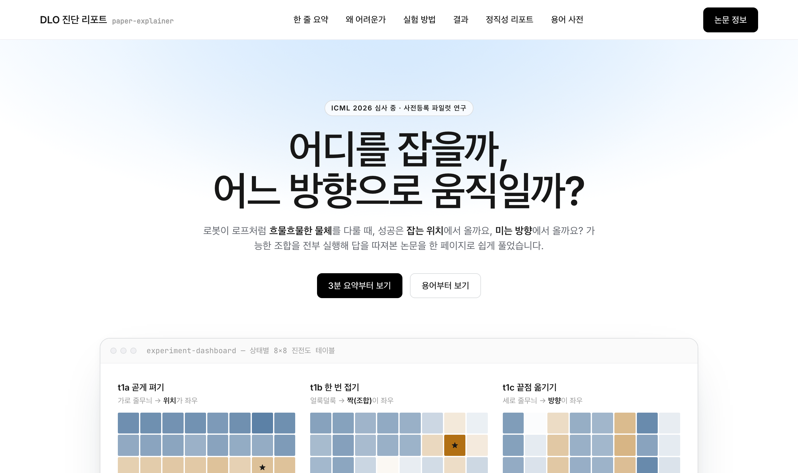

# 🦞 ralph-research

**Where to Act or Which Way to Move** — when a robot manipulates a rope-like deformable object, does one-step success come from *where* it grabs, *which direction* it pushes, or their *interaction*?

Built at the [Ralphthon](https://luma.com/hjuo7auc?tk=7F6B08) hackathon. This repo holds two things:

1. **`research-ralph`** — a lean first pass of an autonomous research pipeline (preregistration → experiments → statistics → paper), and
2. **the study it produced** — *Where to Act or Which Way to Move*, a preregistered pilot under review for ICML 2026 (Track 1).

---

## 📊 Interactive explainer → **[jiminc77.github.io/ralph-research](https://jiminc77.github.io/ralph-research/)**

[](https://jiminc77.github.io/ralph-research/)

A one-page walkthrough of the paper with live heatmaps, formulas, and an interactive demo. (Text is in Korean.)

📑 **Paper (PDF):** [where-to-act-or-which-way-to-move.pdf](docs/where-to-act-or-which-way-to-move.pdf) · 📊 **Evidence report:** [report.md](submissions/ralphthon-icml-track1/report.md) · [grade.json](submissions/ralphthon-icml-track1/grade.json)

---

## The study in one line

> Under the same rope state, goal, candidate count, and simulator budget, how much of one-step action quality is attributable to **contact selection (where)**, **motion-direction selection (how)**, and **their interaction**?

No new algorithm. Instead, a **complete-factorial design** applied to the action space: for each canonicalized rope state, execute all **8 contact positions × 8 motion directions = 64 combinations** and measure the intervention effect directly.

### Key results (dev-split pilot, C0)

| Task | Δ_WH = E[v_P − v_U] | 95% simultaneous CI | Label |
|---|---|---|---|
| t1a straighten | **+0.041** | [+0.029, +0.053] | **contact-dominant** |
| t1b single bend | −0.034 | [−0.073, +0.005] | inconclusive |
| t1c endpoint reposition | **−0.130** | [−0.161, −0.100] | **direction-dominant** |

- **Factor importance flips with the task** — contact matters more when straightening, direction matters more when repositioning an endpoint.
- **The real driver is the *interaction*** — it accounts for **86% / 76%** of the action-table variance on t1a / t1b, larger than either factor alone.
- **The claim is narrow.** The contact factor spans the whole rope (8 arc-length positions) while the direction factor is only 8 fixed-magnitude planar directions — so this is *contact-location choice vs fixed-magnitude planar-direction choice*, not "where vs how" in general.

### Honesty report — these are not confirmatory conclusions

No execution regime passed the preregistered data-quality guard (invalid-table rate ≤ 0.02; 42 of 192 tables were invalid due to a canonicalization re-placement artifact). Every number is therefore reported as **descriptive pilot evidence**; no hidden-split confirmation or clean reproduction was run. Final grade: **C** (valid pilot evidence at reduced sample). All invalid runs are published as-is, not hidden.

---

## Repository layout

**`research-ralph` (v4.1-lean)**

| Path | What |
|---|---|
| [`ralph_core/`](ralph_core/) | Agent supervisor, preflight, guards, schemas, recovery, CLI |
| [`schema/`](schema/) | Core SQLite schema + worker-result JSON schema |
| [`spec-bundle/`](spec-bundle/) | FINAL implementation spec (v4.1-lean), validation, manifest |
| [`venue/`](venue/) | Paper-venue profile + structural check |
| [`tests/`](tests/) | Hermetic module test suite |
| [`DEFERRED.md`](DEFERRED.md) | Surfaces intentionally deferred in this lean pass (by milestone) |

**This study (`where-vs-how-dlo-v1`)**

| Path | What |
|---|---|
| [`RESEARCH_SPEC.md`](RESEARCH_SPEC.md) | Preregistered research spec (harness contract + prose) |
| [`DECISION_POLICY.md`](DECISION_POLICY.md) | Unattended Phase-2 decision policy (wall-clock, topology, selection rule) |
| [`submissions/`](submissions/) | ICML Track 1 submission (paper, figures, repro, grading) |
| [`docs/`](docs/) | Interactive explainer + paper PDF (GitHub Pages) |

---

## Development

The `research-ralph` core runs on Python 3.12 with [uv](https://github.com/astral-sh/uv):

```bash
uv sync         # install dependencies
uv run pytest   # run the hermetic test suite
```

> The scientific pipeline itself (simulator, GPU execution, LaTeX build) ran in a separate workspace (DGCC / DLO-Lab); reproduction commands are in [report.md](submissions/ralphthon-icml-track1/report.md). Tests here are hermetic module tests with adapter seams faked via `tests/fakes/*` (see [`DEFERRED.md`](DEFERRED.md)).

---

## License

© jiminc77. All rights reserved unless stated otherwise — citation and reuse inquiries welcome.
